# CarElectricalRadiatorFanController

Programmable and policy dynamic switchable  PWM car radiator fan controller, as addon or repacement for thermostat on/off switch.
Always wanted to see radator temperatures on your mobile phone? and adjust cooling policy, or write your own policy?  if yes read on.
Just a warning, that just a radiator fan termostat switch is FAR easier, more proven technology, and cheaper.
But this is WAY more fun!, boosts your learning curve and saves your fan by softstarting, and lot more flexibility)

## Source origin

http://github.com/iafilius/CarElectricalRadiatorFanController/

## Introduction

 *   Triggered by the thread on dubbellucht.nl to replace the mechanical radiator fan on an oldtimer van for an electical one to gain some power/save some fuel and produce less noice.
 *   But instead fixed location/fixed temperature - thermostat switch with on/off characteristics, i started working on a project using multiple temperature sensors, and microsprocessor controlled PWM Fan motor control.
 *   Started with an arduino leonardo 32U4 micro board, wich worked fine, but soon ran into available memory issue which limited development (even after memory tuning with strings to EEPROM etc).
 *   Switched to the ESP32 platform, with "lots" of memory and lots of integrated options, basically a few generations newer platform.
 *   Alltough it still compiles for leonardo/32U4, development has stopped due lack of space, and lost interrest.
 *   I use the The ESP-WROOM-32 development board , available for about $5 with shipment.
 *   Idea was using both Bluetooth AND WiFi, but abandonned/(put on hold) bluetooth for 3 reasons:
 *    - it eats a real _HUGE_ amount of flash, and needed to repsrtition the 4MB flash
 *    - it eats a quite part of available memory as well (which led to frequent crashes)
 *    - Need to write a native app, and IOS development still can't be doen without investing (money and time)
 *   Shifted focus from serial console to WIFI/webbased, and most importand item are available .. on you phone...
 *   So these days WiFi/webapp is the main focus, and in Cockpit view you can monitor the behavious realtime of the temperatures, and fan status, and you can change the policy/function on the fly from a webbased menu.
 *   After some several firmware updates, I enabled firmware updates over wifi, as the USB port is hidden/water proofed inside the motor room, and my laptop contains policies which make native OTA (read incoming connections) imposible.
 *  

## Features

 *  multi platform (Arduino AVR (ex Leonardo), Arduino ESP32 (ex Doit Devkit V1), features depend on platform and available memory
 *  Configureable Fan Softstart (time) (AVR/ESP32)
 *  Support Dallas DS18B20 temperature sensors
 *    - One designed to be in upper radator hose usinng a well
 *    - One designed to be in lower radator hose
 *    - Selectable resolution 
 *  Oled display (AVR/ESP32)
 *  Persistent parameters (store to NVRAM/EEPROM)
 *  USB/Serial console access
 *    -logging
 *    -dump actual/startup configuration to screen
 *    -setup/configure parameters
 *   Multiple cooling policies/functions
 *    -Realtime change cooling function/policy (either USB/serial or via WIFI (ESP32 only))
 *    -Easy to add you own cooling function compile time.
 *   WiFI (ESP32 only)
 *    webserver:
        * Cockpit view, with realtime data using SSE
        * Setup page
        * debug page
        * firmware update page
*  WiFi
        * does not advertise a default route, and does not disable 3/4G access
 *   RPM measurement
        * basic RPM measurement support, for future integration in cooling functions/policies
 *   Firmware upgrade options
        * USB (AVR & ESP32) through Arduino IDE
        * OTA (WIFI) (ESP32) through Arduino IDE, native OTA but needs rights on client for opening up ports, may not work on corporate workstation, even with elevated rights.
        * Webserver (WIFI) (ESP32), use file upload from any browser and choose bin file from <srcdir>\*.bin. no specefic rights on laptop required. (export/compile binary \<sketch\>-\>export compiled binary)
 *   Watchdog
        * 
 *   Service announcement through Bonjour/MDNS on WiFi (ESP32)
        * use Bonjoursearch (IOS)

## Software Module dependency

 *    ESP32 core for arduino (ESP32)
 *    TimerOne/TimerThree (AVR)
 *    SSD1306Ascii (AVR)
 *    SSD1306 (ESP32)
 *    SSD1306AsciiAvrI2c
 *    OneWire
 *    DallasTemperature
 *    AsyncTCP (ESP32/WiFI/webserver) (need to download from github)
 *    ESPAsyncWebServer (need to download from github)
 *    WiFiManager ESP32 (planned ESP32)

## Buildin policies

 *    fan permanent off
 *    fan permanent on
 *    policy trying to keep some thermal capacity reserve ()
 *    policy to turn fan on above a certain temperature (90 degrees celsius)
 *    policy to turn fan on above a certain temperature (85 degrees celsius)
 *    <put your smarter functions here>

## Hardware list

 * Biggest/strongest electrical radiator fan you can fit/buy, example SPAL VA18-AP71/LL-59A 
    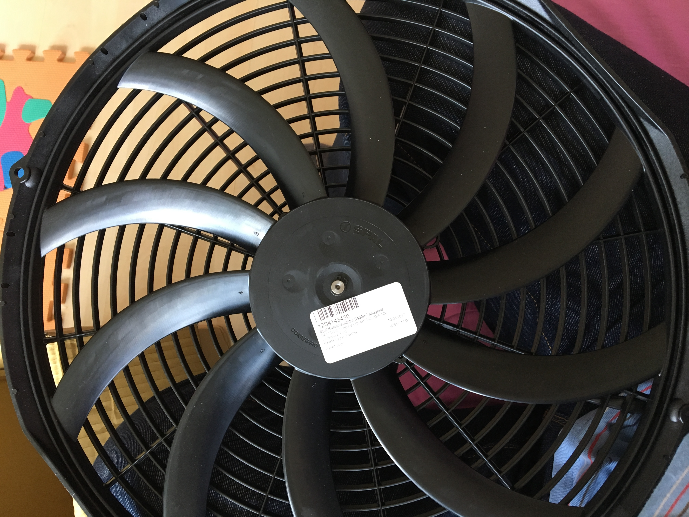
    
 * Fet Module designed to switch PWM/inductive loads, ex DS16 PWM Motor Speed Controll controller 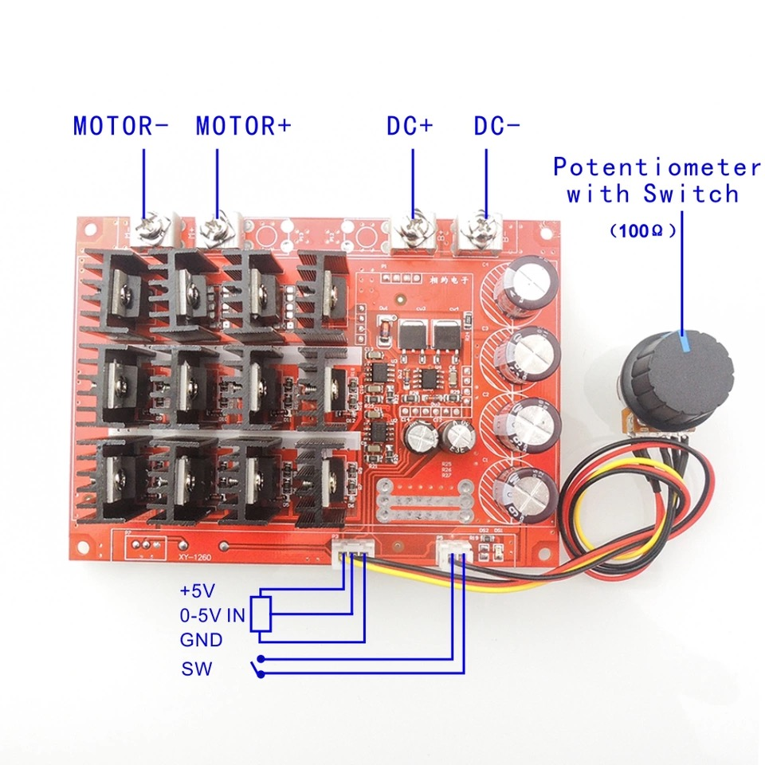
 * Fet Driver IC (ex MIC4422YN)
 * a mini switching power supply for microcontroller module (generating 7 V (or 5V or 3,3 at your choice), accepts 8-24V)
        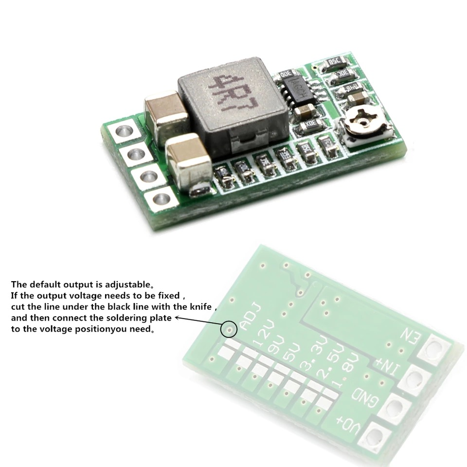
 * Arduino module (eg Leonaro), or ESP wroom-32 Dev board, or just the ESP wroom-32 module itself
       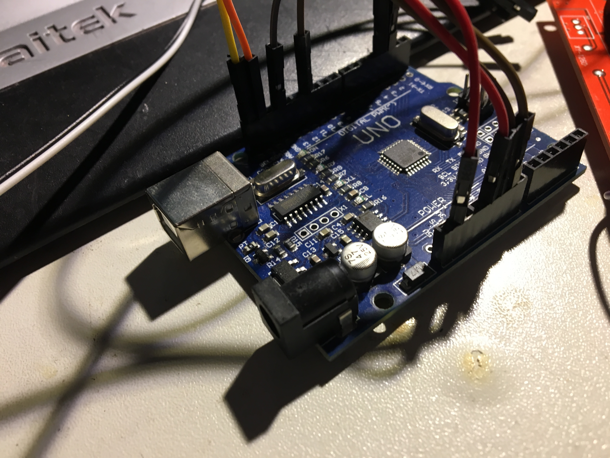
       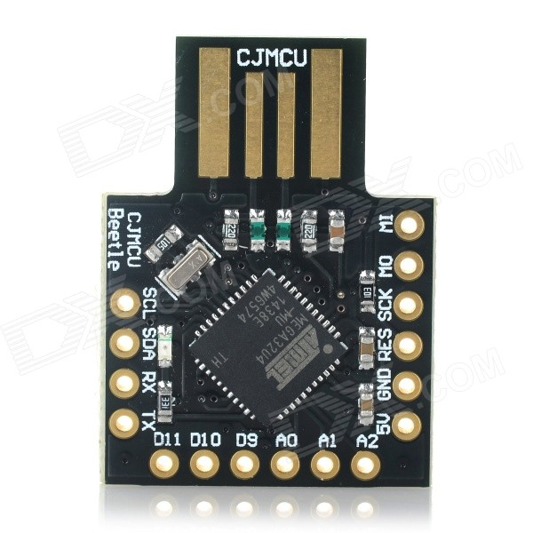
       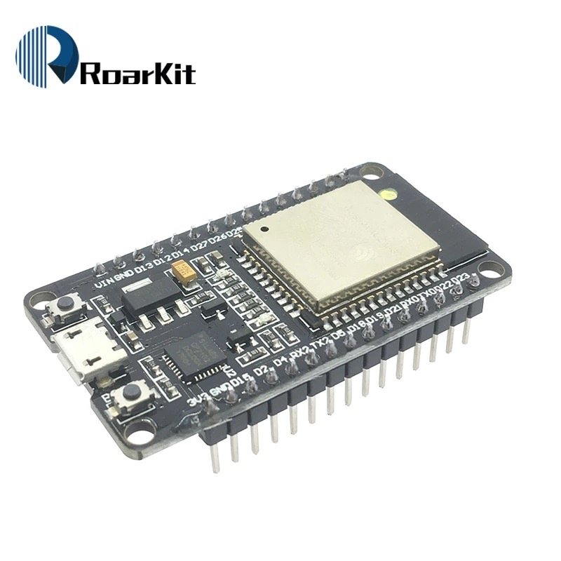
       
 * DS18B20 temperature sensors with (rounded) stainless protection tube
       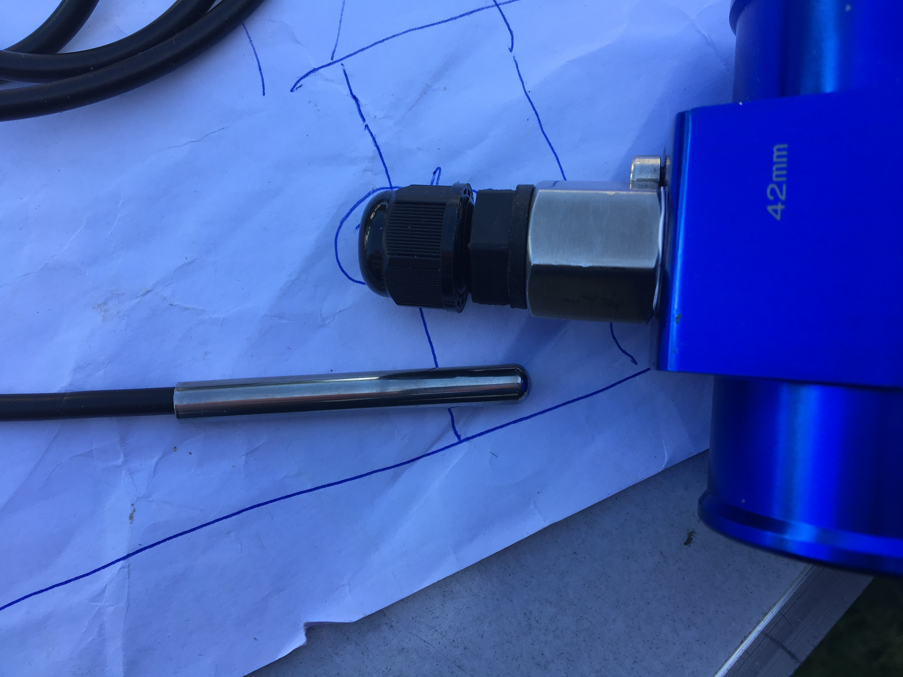
 * Thermowell for inserting the DS18B20 sensors.
        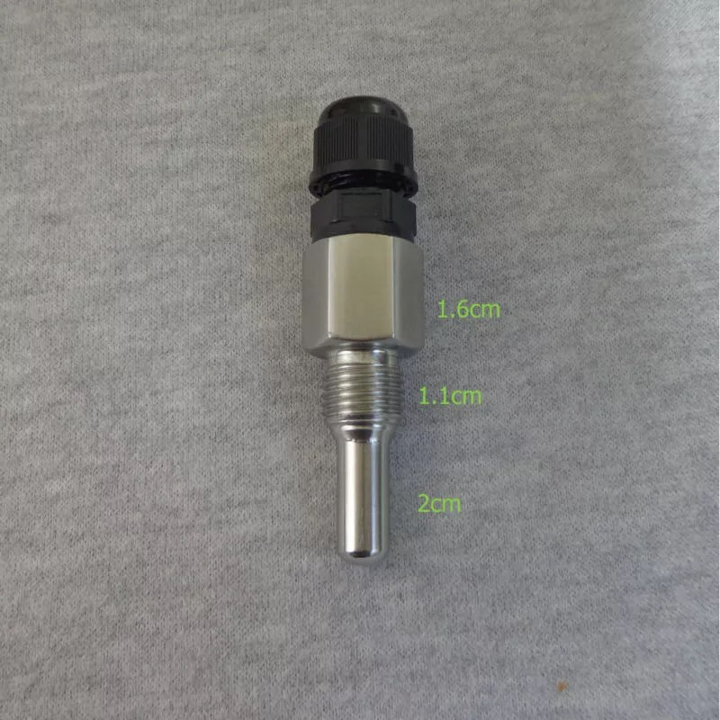
 * Oled Screen (1306) (optional) (0.96" I2C IIC 128x64 Blue)
        You might want to use the display in your cockpit, maybe not (Using ESp32 with WiFi and webapp.....)
 * thermal grease for inserting the sensors into the thermowell.
        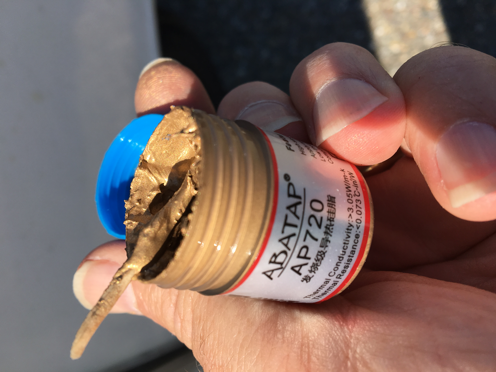
 * radiator hose temperature sensor adapter (get biggest diameter you can fit, eg 42mm) (to insert the termowell)
        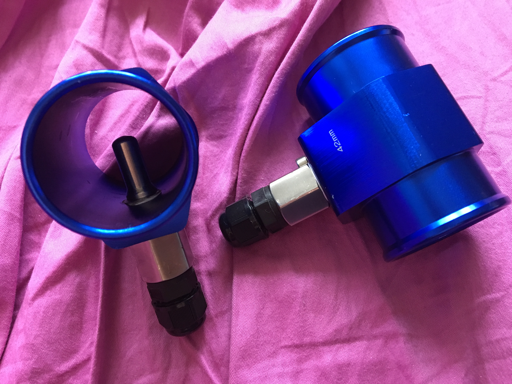
 * 2 short pieces radiator hoses, (when you don't want to cut the original hoses)
        
 * Some crimping tubes, wires, fuses, relais etc, teflon table, hose-clamps etc.
 

## Electrical Schema

Schema which hs been used:
        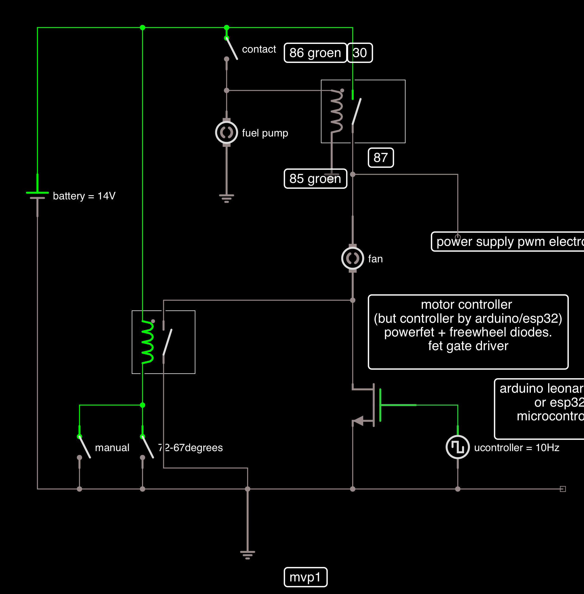
The schema is an export of the iCircuit simulation.

## Convert the DC motor controller to a DC motor switching unit

A (FET) PWM switch unit is needed capable of switching inductive load.
I could not find any for high currents, and having freewheel diodes already mounted, so I bought a cheap high power DC motor controller, and disabled the controll part.
The leftover "dumb" switching module is levelled-up and beefed up with a  (non inverting) FET driver  IC MIC4422YN, ready to accept the output of an ESP32 on 3.3V or Arduino on 5V.

## Note on coding and comments

* The code has not been cleaned-up, and lots of debug and comments are still in code.
* The code works on and Arduino Leonardo/32U4 and ESP32, which has led to many compromisses, not using the ESP32 in full potential

## Questions? Bugs? Issues? Feature Request?

use github capabilities preferred, or else you may contact me directly.

